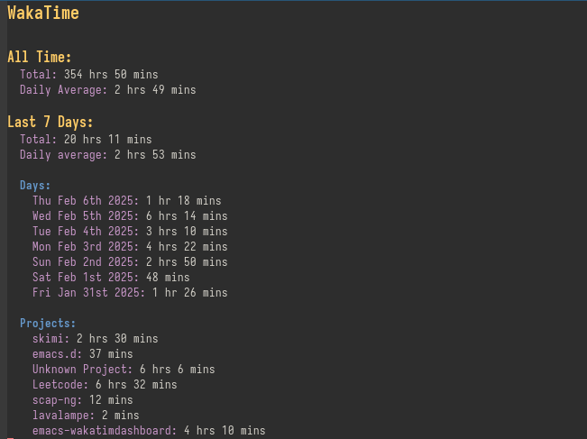

# Emacs WakaTime Dashboard



### Installation

Add the following lines to your emacs configuration:

```emacs-lisp
(setq wakatime-dashboard-api-key "YOUR-WAKATIME-API-KEY")
(unless (package-installed-p 'wakatime-dashboard)
  (package-vc-install
  '(wakatime-dashboard
  :url "https://github.com/MAlba124/emacs-wakatime-dashboard.git")))
(require 'wakatime-dashboard)
```

The dashboard can then be opened my running the `wakatime-dashboard` command.
